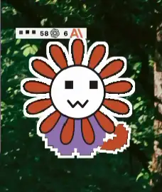
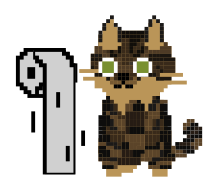
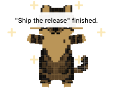
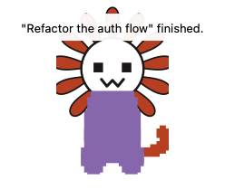
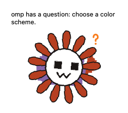
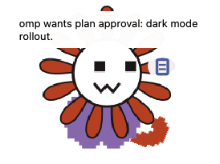
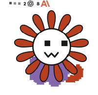
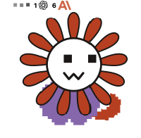
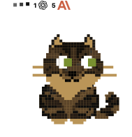

# Clawdi

It's a pet Claude that keeps track of all the Claudes! Optionally you also get to have my cat do that instead.

<p align="center">
  <a href="docs/img/hero.webm">
    
  </a>
</p>

Clawdi sits on your desktop, lives its little life, and reports on your coding agents — who's thinking, who finished, who's stuck waiting for you. It's a native AppKit/Core Animation desktop pet: no Electron, no WebView, no Node at runtime. Every pose is line geometry pushed through a hand-rolled pixel renderer into a borderless, click-through panel that floats over all your Spaces.

## The pet part

- It watches your cursor, blinks, and cocks its head when you hover nearby.
- Pet its head and it purrs. Actual purr audio. Hearts.
- When you type, it types too (tiny paw taps). When you scroll, it gets a toilet-paper roll to bat around. Shake the mouse and it drops into a hunting crouch, pupils huge.
- Grab it and pull: mochi stretch, the body stretches like a noodle. It also stretches on a schedule (every 30 min by default) to remind you to do the same.
- Ignore the computer for ~4 minutes and it curls up and sleeps, z's floating. Come back and it wakes up with a big stretch.
- It talks in a speech bubble: reminders, timer, agent news, or whatever message you pin.

<p align="center">
  
  &nbsp;&nbsp;
  
</p>

## The keeping-track-of-Claudes part

On launch, Clawdi quietly wires itself into **Claude Code** (`~/.claude/settings.json`), **Cursor** (`~/.cursor/hooks.json`), **Antigravity** (`~/.gemini/config/hooks.json`), and **omp** (a generated extension in `~/.omp/agent/extensions/`). Under the hood every hook calls the app binary itself (`Clawdi --clawdi-hook <event>`), which drops one JSON event onto a local Unix socket. That's the whole protocol.

Use **right-click → Extensions** to disable Claude Code, Cursor, Antigravity, or omp independently. Disabling an extension removes Clawdi's hook configuration (or its omp module) immediately and rejects any late event from that extension's tagged socket protocol; enabling it reinstalls the integration.

While your agents work, the pet thinks along: animated dots, a badge counting live sessions per vendor with the OpenAI and Anthropic marks (that's the "58 … 6" in the video — yes, those were real), and it kneads its front paws like a blanket whenever you're not typing. When something actually needs you, it does one of these:

| Completion | Question | Plan approval | Thinking |
| :---: | :---: | :---: | :---: |
|  |  |  |  |
| Jump, sparkles, meow, `"Fix flaky tests" finished.` | Head-tilt + ? badge when the agent asks you something | Pop + clipboard badge when a plan wants approval | Dots, per-vendor session counts, kneading paws |

It's picky about what counts as "finished" on purpose: only the main session's titled stop fires the jump — subagents, tool loops, and background continuations stay quiet, and errors or cancels just clear silently. No confetti for a crash, no meow spam from 40 subagents.

And when omp lands an edit, the pet throws the diff like an FPS damage number: a little `pi>file.ts +12 -12` pill (added green, removed red, zeros omitted) shoots off its head, arcs into the sky, and fades midair — one per edited file.

Want to see the reactions without waiting for a real agent? Fire them at the running app:

```sh
just demo complete   # complete | ask | plan | knead | edit | all
```

## Characters

Two of them, in **Pet → Character**. Flowery Claude is the default; the cat is the original.

| Flowery Claude (default) | Cat |
| :---: | :---: |
|  |  |

They're the same creature underneath — one animation engine, and a skin just swaps the pose-geometry library, so blinking, kneading, jumping, all of it comes for free. Flowery Claude is generated from the cat rig by a script (`just gen-assets`): swap the head for a round white face, crown it with a terracotta daisy, bake in the canonical palette (purple shirt `#9b7cb8`, terracotta petals `#c8552f`). Baked means baked — your custom cat pattern can't bleed through, because a tabby pattern under an orange daisy head reads as "bee", and we learned that the hard way.

The cat's coat, though, is all yours: **Pet → Pattern editor** lets you paint spots cell by cell, comes with seven presets (black, white, orange, calico, mackerel, siamese, russian blue), and imports/exports custom ones as files.

## Also in the box

- **Pomodoro** — focus/break countdown in a bubble on the pet; pause and resume right from the bubble.
- **Reminders** — timed messages (daily, weekdays, weekends, custom days), delivered with a bubble and an alert meow, addressed to you by name.
- **Share cat** — records a vertical 1080×1920 MP4 of the pet doing its thing, crop following it around, name badge stamped on.
- **Fixed message** — pin a permanent speech bubble.
- **Size** — anywhere from 20 to 400 px. Pixel-crisp at all of them.
- **Sounds** — completion meow (volume's yours, off is fine), alert meow, purr loop.
- **Launch at login** — on by default, so it's just there after a reboot.

Settings, patterns, presets, and the generated hook configs all live in `~/Library/Application Support/Clawdi/`.

**Permissions:** Accessibility and Input Monitoring power the input reactions (typing paws, nap/wake, purring); Screen Recording is only for Share cat. Builds are signed so the grants stick across rebuilds (see [Code signing](DEVELOPMENT.md#code-signing)).

## Development

For instructions on building, code signing, shipping, and testing, see [DEVELOPMENT.md](DEVELOPMENT.md).

